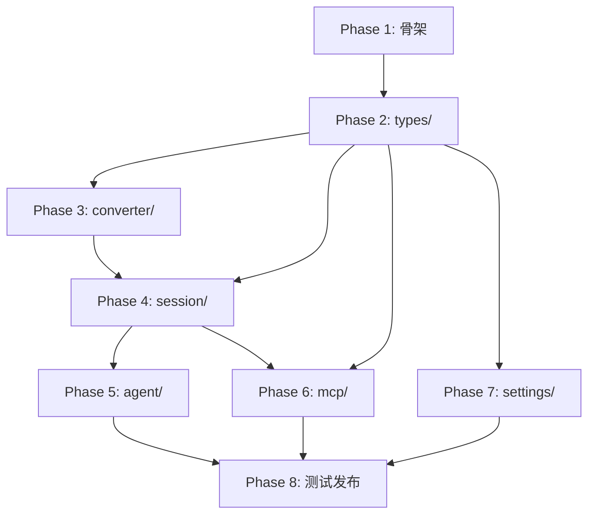

# Claude Code ACP Agent (Rust) 开发计划

## 概述

本文档基于 `claude-code-acp-spec.md` 技术设计文档，制定详细的开发计划。

**目标**: 实现一个 Rust 版本的 ACP (Agent Client Protocol) Agent，使 Zed 等 ACP 兼容编辑器能够使用 Claude Code 的能力。

**项目特点**:
- 单一 crate 结构，便于发布到 crates.io
- 支持 Meta 字段（systemPrompt、resume session_id）
- 支持环境变量配置国内大模型

---

## Phase 1: 项目骨架搭建

### 1.1 项目初始化

**任务列表**:

- [ ] 1.1.1 创建 `Cargo.toml`
  - 配置 package 信息（name, description, keywords, categories）
  - 配置 bin 和 lib targets
  - 添加所有依赖

- [ ] 1.1.2 创建 `src/main.rs` CLI 入口
  - 基础日志初始化 (tracing-subscriber)
  - 调用 `claude_code_acp::run_acp()`

- [ ] 1.1.3 创建 `src/lib.rs` 库入口
  - 模块声明
  - 公共 API 导出

- [ ] 1.1.4 配置 `rust-toolchain.toml`
  - 指定 Rust Edition 2024
  - 配置 nightly channel（如需要 2024 edition）

- [ ] 1.1.5 配置 `.gitignore` 和 `rustfmt.toml`

### 1.2 创建模块骨架

按依赖顺序创建各模块:

- [ ] 1.2.1 创建 `src/types/` 公共类型模块
  ```
  src/types/
  ├── mod.rs
  ├── error.rs        # AgentError 定义
  ├── config.rs       # AgentConfig 定义
  ├── meta.rs         # NewSessionMeta, SystemPromptMeta, ClaudeCodeMeta
  ├── session.rs      # TokenUsage, SessionStats 等
  ├── tool.rs         # ToolInfo, ToolKind 等
  └── notification.rs
  ```

- [ ] 1.2.2 创建 `src/converter/` 消息转换模块
  ```
  src/converter/
  ├── mod.rs
  ├── prompt.rs       # ACP → SDK 转换
  ├── notification.rs # SDK → ACP 转换
  └── tool.rs         # 工具信息提取
  ```

- [ ] 1.2.3 创建 `src/settings/` 设置管理模块
  ```
  src/settings/
  ├── mod.rs
  └── manager.rs
  ```

- [ ] 1.2.4 创建 `src/session/` 会话管理模块
  ```
  src/session/
  ├── mod.rs
  ├── manager.rs      # SessionManager
  ├── state.rs        # Session 状态
  ├── permission.rs   # PermissionHandler
  └── usage.rs        # UsageTracker
  ```

- [ ] 1.2.5 创建 `src/mcp/` MCP Server 模块
  ```
  src/mcp/
  ├── mod.rs
  ├── server.rs
  └── tools/
      ├── mod.rs
      ├── read.rs
      ├── write.rs
      ├── edit.rs
      └── bash.rs
  ```

- [ ] 1.2.6 创建 `src/agent/` Agent 核心模块
  ```
  src/agent/
  ├── mod.rs
  ├── core.rs         # ClaudeAcpAgent
  ├── handlers.rs     # ACP 请求处理器
  └── runner.rs       # run_acp()
  ```

- [ ] 1.2.7 创建 `src/util/` 工具函数模块

### 1.3 验证构建

- [ ] 1.3.1 确保 `cargo build` 成功
- [ ] 1.3.2 确保 `cargo test` 通过（空测试）
- [ ] 1.3.3 确保 `cargo clippy` 无警告

---

## Phase 2: 公共类型实现 (types/)

### 2.1 错误类型

- [ ] 2.1.1 实现 `AgentError` 枚举
  - SessionNotFound
  - AuthRequired
  - InvalidMode
  - ToolExecutionFailed
  - ClaudeSdkError
  - IoError
  - JsonError
  - Internal

- [ ] 2.1.2 实现 `From<AgentError> for sacp::RequestError`

### 2.2 配置类型

- [ ] 2.2.1 实现 `AgentConfig`
  - `base_url: Option<String>`
  - `auth_token: Option<String>`
  - `model: Option<String>`
  - `small_fast_model: Option<String>`

- [ ] 2.2.2 实现 `AgentConfig::from_env()`
  - 读取 `ANTHROPIC_BASE_URL`
  - 读取 `ANTHROPIC_AUTH_TOKEN`
  - 读取 `ANTHROPIC_MODEL`
  - 读取 `ANTHROPIC_SMALL_FAST_MODEL`

- [ ] 2.2.3 实现 `AgentConfig::apply_to_options()`

### 2.3 Meta 字段类型 (新增)

- [ ] 2.3.1 实现 `SystemPromptMeta` 结构
  - `append: Option<String>` - 追加到系统提示词
  - `replace: Option<String>` - 替换系统提示词
  - `from_meta()` 解析方法

- [ ] 2.3.2 实现 `ClaudeCodeMeta` 结构
  - `options: Option<ClaudeCodeOptions>`
  - `from_meta()` 解析方法
  - `get_resume_session_id()` 获取恢复会话 ID

- [ ] 2.3.3 实现 `ClaudeCodeOptions` 结构
  - `resume: Option<String>` - 要恢复的会话 ID

- [ ] 2.3.4 实现 `NewSessionMeta` 结构
  - `system_prompt: Option<SystemPromptMeta>`
  - `claude_code: Option<ClaudeCodeMeta>`
  - `from_request_meta()` 统一解析方法
  - `get_system_prompt_append()` 获取追加提示词
  - `get_resume_session_id()` 获取恢复会话 ID

### 2.4 会话类型

- [ ] 2.4.1 实现 `TokenUsage` 结构
  - `input_tokens: u64`
  - `output_tokens: u64`
  - `cache_read_input_tokens: Option<u64>`
  - `cache_creation_input_tokens: Option<u64>`

- [ ] 2.4.2 实现 `TokenUsage::from_sdk_usage()`
- [ ] 2.4.3 实现 `TokenUsage::add()`
- [ ] 2.4.4 实现 `SessionStats` 结构

### 2.5 工具类型

- [ ] 2.5.1 实现 `ToolKind` 枚举
- [ ] 2.5.2 实现 `ToolInfo` 结构
- [ ] 2.5.3 实现 `ToolCallLocation` 结构
- [ ] 2.5.4 实现 `ToolUseEntry` 和 `ToolUseType`

### 2.6 单元测试

- [ ] 2.6.1 `AgentConfig::from_env()` 测试
- [ ] 2.6.2 `NewSessionMeta::from_request_meta()` 测试
- [ ] 2.6.3 `TokenUsage` 序列化/反序列化测试
- [ ] 2.6.4 错误转换测试

---

## Phase 3: 消息转换实现 (converter/)

### 3.1 Prompt 转换 (ACP → SDK)

- [ ] 3.1.1 实现 `PromptConverter` 结构
- [ ] 3.1.2 实现 `convert_text_chunk()` - 文本块转换
- [ ] 3.1.3 实现 `convert_resource_link()` - 资源链接转换
- [ ] 3.1.4 实现 `convert_resource()` - 资源内容转换
- [ ] 3.1.5 实现 `convert_image()` - 图片转换为 `UserContentBlock::image_*`

### 3.2 通知转换 (SDK → ACP)

- [ ] 3.2.1 实现 `NotificationConverter` 结构
- [ ] 3.2.2 实现 `convert_message()` - 主转换入口
- [ ] 3.2.3 实现 `convert_assistant_message()` - 处理 ContentBlock
- [ ] 3.2.4 实现 `convert_stream_event()` - 处理增量事件
- [ ] 3.2.5 实现各类通知生成方法:
  - `make_agent_message_notification()`
  - `make_agent_message_chunk_notification()`
  - `make_agent_thought_notification()`
  - `make_agent_thought_chunk_notification()`
  - `make_tool_call_notification()`
  - `make_tool_result_notification()`

### 3.3 工具信息提取

- [ ] 3.3.1 实现 `extract_tool_info()` - 从工具名称和输入提取 UI 友好信息
- [ ] 3.3.2 支持的工具类型:
  - Read/Write/Edit → ToolKind::Read/Edit
  - Bash → ToolKind::Execute
  - Grep/Glob → ToolKind::Search
  - WebFetch → ToolKind::Fetch

### 3.4 单元测试

- [ ] 3.4.1 文本转换测试
- [ ] 3.4.2 图片转换测试
- [ ] 3.4.3 工具调用通知测试
- [ ] 3.4.4 流式事件转换测试

---

## Phase 4: 会话管理实现 (session/)

### 4.1 UsageTracker 实现

- [ ] 4.1.1 实现 `UsageTracker` 结构
  - `total_usage: RwLock<TokenUsage>`
  - `total_cost_usd: AtomicU64`

- [ ] 4.1.2 实现 `update_from_result()` - 从 ResultMessage 更新
- [ ] 4.1.3 实现 `get_usage()` 和 `get_cost_usd()`

### 4.2 PermissionHandler 实现

- [ ] 4.2.1 实现 `PermissionHandler` 结构
  - `pending_requests: DashMap<String, PendingPermissionRequest>`
  - `notifier: Arc<dyn AcpNotifier>`

- [ ] 4.2.2 实现 `PendingPermissionRequest` 结构
- [ ] 4.2.3 实现 `create_can_use_tool_callback()` - 创建 SDK 权限回调
- [ ] 4.2.4 实现 `handle_permission_response()` - 处理 ACP 客户端响应
- [ ] 4.2.5 实现 `acp_mode_to_sdk_mode()` 和 `sdk_mode_to_acp_mode()`

### 4.3 Session 实现

- [ ] 4.3.1 实现 `Session` 结构
  - `client: ClaudeClient`
  - `cancelled: AtomicBool`
  - `permission_mode: RwLock<SdkPermissionMode>`
  - `usage_tracker: UsageTracker`
  - `converter: NotificationConverter`
  - `system_prompt_append: Option<String>` (新增: 来自 meta)

- [ ] 4.3.2 实现 `Session::new()` - 创建会话并连接 ClaudeClient
  - 支持 `meta.systemPrompt.append` 追加系统提示词
  - 支持 `meta.claudeCode.options.resume` 恢复会话

- [ ] 4.3.3 实现 `Session::prompt()` - 发送内容并返回消息流
- [ ] 4.3.4 实现 `Session::prompt_text()` - 发送文本 prompt
- [ ] 4.3.5 实现 `Session::interrupt()` - 中断当前执行
- [ ] 4.3.6 实现 `Session::set_permission_mode()` - 设置权限模式
- [ ] 4.3.7 实现 `Session::set_model()` - 动态切换模型
- [ ] 4.3.8 实现 `Session::process_response_stream()` - 处理消息流
- [ ] 4.3.9 实现 `Session::disconnect()` - 断开连接

### 4.4 SessionManager 实现

- [ ] 4.4.1 实现 `SessionManager` 结构
  - `sessions: DashMap<String, Arc<RwLock<Session>>>`
  - `config: AgentConfig`
  - `permission_handler: Arc<PermissionHandler>`

- [ ] 4.4.2 实现 `create_session()` - 创建新会话
  - 接收 `NewSessionMeta` 参数处理 systemPrompt 和 resume

- [ ] 4.4.3 实现 `get_session()` - 获取会话
- [ ] 4.4.4 实现 `remove_session()` - 移除并断开会话
- [ ] 4.4.5 实现 `get_session_stats()` - 获取统计信息

### 4.5 单元测试

- [ ] 4.5.1 UsageTracker 更新测试
- [ ] 4.5.2 权限模式转换测试
- [ ] 4.5.3 SessionManager 并发测试
- [ ] 4.5.4 Meta 解析和会话创建测试

---

## Phase 5: Agent 核心实现 (agent/)

### 5.1 ClaudeAcpAgent 结构

- [ ] 5.1.1 实现 `ClaudeAcpAgent` 结构
  - `session_manager: SessionManager`
  - `config: AgentConfig`
  - `permission_handler: Arc<PermissionHandler>`

- [ ] 5.1.2 实现 `ClaudeAcpAgent::new()`

### 5.2 ACP 请求处理器

- [ ] 5.2.1 实现 `initialize()` 处理器
  - 返回 Agent 能力信息
  - 设置 client capabilities

- [ ] 5.2.2 实现 `authenticate()` 处理器（可选）

- [ ] 5.2.3 实现 `new_session()` 处理器
  - 解析 `_meta` 字段获取 `NewSessionMeta`
  - 处理 `systemPrompt` 追加
  - 处理 `claudeCode.options.resume` 恢复会话
  - 调用 `SessionManager::create_session()`
  - 返回 session_id 和 supported_modes

- [ ] 5.2.4 实现 `load_session()` 处理器
  - 同样支持 `_meta` 字段解析

- [ ] 5.2.5 实现 `prompt()` 处理器
  - 获取 session
  - 转换 ACP content 为 SDK UserContentBlock
  - 调用 `session.prompt()`
  - 处理响应流并发送通知
  - 返回 PromptResponse

- [ ] 5.2.6 实现 `cancel()` 处理器
  - 调用 `session.interrupt()`

- [ ] 5.2.7 实现 `set_session_mode()` 处理器
  - 调用 `session.set_permission_mode()`

### 5.3 ACP 通知发送

- [ ] 5.3.1 实现 `AcpNotifier` trait
- [ ] 5.3.2 实现基于 `JrHandlerChain` 的通知发送

### 5.4 Agent Runner

- [ ] 5.4.1 实现 `run_acp()` 函数
  - 加载环境变量配置
  - 创建 ClaudeAcpAgent
  - 构建 JrHandlerChain
  - 注册所有请求处理器
  - 启动 ByteStreams 服务

### 5.5 集成测试

- [ ] 5.5.1 initialize 请求测试
- [ ] 5.5.2 new_session 请求测试（含 meta 字段）
- [ ] 5.5.3 prompt 请求测试
- [ ] 5.5.4 cancel 请求测试
- [ ] 5.5.5 set_mode 请求测试

---

## Phase 6: MCP Server 实现 (mcp/)

### 6.1 MCP Server 基础

- [ ] 6.1.1 集成 `rmcp` 库
- [ ] 6.1.2 实现 `McpServer` 结构
- [ ] 6.1.3 实现 `McpTool` trait

### 6.2 内置工具实现

- [ ] 6.2.1 实现 `ReadTool`
  - 输入: `file_path`, `offset`, `limit`
  - 输出: 文件内容

- [ ] 6.2.2 实现 `WriteTool`
  - 输入: `file_path`, `content`
  - 输出: 写入状态

- [ ] 6.2.3 实现 `EditTool`
  - 输入: `file_path`, `old_string`, `new_string`, `replace_all`
  - 输出: 编辑结果

- [ ] 6.2.4 实现 `BashTool`
  - 输入: `command`, `description`, `timeout`
  - 输出: 命令执行结果

- [ ] 6.2.5 实现 `KillShellTool`
- [ ] 6.2.6 实现 `BashOutputTool`

### 6.3 工具集成

- [ ] 6.3.1 注册工具到 MCP Server
- [ ] 6.3.2 实现工具权限检查

### 6.4 单元测试

- [ ] 6.4.1 Read 工具测试
- [ ] 6.4.2 Write 工具测试
- [ ] 6.4.3 Edit 工具测试
- [ ] 6.4.4 Bash 工具测试

---

## Phase 7: 设置管理实现 (settings/)

### 7.1 SettingsManager

- [ ] 7.1.1 实现 `SettingsManager` 结构
- [ ] 7.1.2 实现设置文件加载
  - User settings: `~/.claude/settings.json`
  - Project settings: `.claude/settings.json`
  - Local settings: `.claude/settings.local.json`

- [ ] 7.1.3 实现设置合并逻辑（优先级: Local > Project > User）

---

## Phase 8: 测试、文档与发布

### 8.1 单元测试完善

- [ ] 8.1.1 达到核心模块 80% 测试覆盖率
- [ ] 8.1.2 添加边界条件测试
- [ ] 8.1.3 添加错误处理测试

### 8.2 集成测试

- [ ] 8.2.1 完整会话流程测试
- [ ] 8.2.2 多会话并发测试
- [ ] 8.2.3 权限请求/响应测试
- [ ] 8.2.4 Token 用量统计测试
- [ ] 8.2.5 Meta 字段端到端测试

### 8.3 E2E 测试

- [ ] 8.3.1 与 Zed 编辑器集成测试
- [ ] 8.3.2 环境变量配置测试
- [ ] 8.3.3 错误恢复测试
- [ ] 8.3.4 会话恢复测试（resume）

### 8.4 文档

- [ ] 8.4.1 API 文档 (rustdoc)
- [ ] 8.4.2 README.md 使用说明
- [ ] 8.4.3 环境变量配置说明
- [ ] 8.4.4 Meta 字段使用说明
- [ ] 8.4.5 CHANGELOG.md

### 8.5 发布准备

- [ ] 8.5.1 更新 Cargo.toml 版本号
- [ ] 8.5.2 检查依赖是否可发布（vendors → crates.io/git）
- [ ] 8.5.3 运行 `cargo publish --dry-run`
- [ ] 8.5.4 正式发布 `cargo publish`

---

## 里程碑

### M1: 项目骨架完成
- Phase 1 完成
- 所有模块能够编译
- 依赖关系正确

### M2: 核心类型就绪
- Phase 2 完成
- types/ 所有类型可用（含 Meta 类型）
- 单元测试通过

### M3: 消息转换可用
- Phase 3 完成
- ACP ↔ SDK 消息转换正常工作
- 单元测试通过

### M4: 会话管理可用
- Phase 4 完成
- Session 创建、查询、销毁正常
- 权限处理正常
- Token 统计正常
- Meta 字段解析正常

### M5: Agent MVP
- Phase 5 完成
- 基础 ACP 协议支持
- 可以与编辑器进行基本交互
- 支持 systemPrompt 和 resume 功能

### M6: 功能完整
- Phase 6, 7 完成
- MCP 内置工具可用
- 设置管理可用

### M7: 发布就绪
- Phase 8 完成
- 测试覆盖率达标
- 文档完善
- 成功发布到 crates.io

---

## 依赖关系图



---

## 风险与缓解

### 风险 1: SDK 兼容性
- **描述**: claude-agent-sdk-rs 版本更新可能破坏兼容性
- **缓解**: 使用 git submodule 固定版本，定期检查更新

### 风险 2: ACP 协议变更
- **描述**: ACP 协议可能有 breaking changes
- **缓解**: 关注 agent-client-protocol 仓库更新，保持协议同步

### 风险 3: 并发问题
- **描述**: DashMap 使用不当可能导致死锁
- **缓解**: 使用 entry API，避免嵌套锁

### 风险 4: 环境变量安全
- **描述**: AUTH_TOKEN 等敏感信息泄露
- **缓解**: 不在日志中打印敏感信息

### 风险 5: crates.io 发布依赖
- **描述**: vendors 目录下的依赖无法直接用于 crates.io 发布
- **缓解**: 发布时切换为 git 依赖或等待上游发布到 crates.io

---

## 附录

### A. 开发环境要求

- Rust: nightly (for edition 2024)
- 依赖:
  - tokio
  - serde / serde_json
  - dashmap
  - thiserror / anyhow
  - tracing / tracing-subscriber
  - uuid
  - futures
  - rmcp

### B. 测试命令

```bash
# 运行所有测试
cargo test

# 运行特定模块测试
cargo test types::
cargo test session::
cargo test agent::

# 运行集成测试
cargo test --test integration

# 检查代码风格
cargo clippy
cargo fmt --check
```

### C. 构建命令

```bash
# Debug 构建
cargo build

# Release 构建
cargo build --release

# 安装到系统
cargo install --path .

# 发布到 crates.io
cargo publish --dry-run
cargo publish
```

### D. Meta 字段示例

**systemPrompt 追加**:
```json
{
  "_meta": {
    "systemPrompt": {
      "append": "请用中文回复"
    }
  }
}
```

**恢复会话**:
```json
{
  "_meta": {
    "claudeCode": {
      "options": {
        "resume": "session-uuid-12345"
      }
    }
  }
}
```

**组合使用**:
```json
{
  "_meta": {
    "systemPrompt": {
      "append": "请用中文回复"
    },
    "claudeCode": {
      "options": {
        "resume": "session-uuid-12345"
      }
    }
  }
}
```
