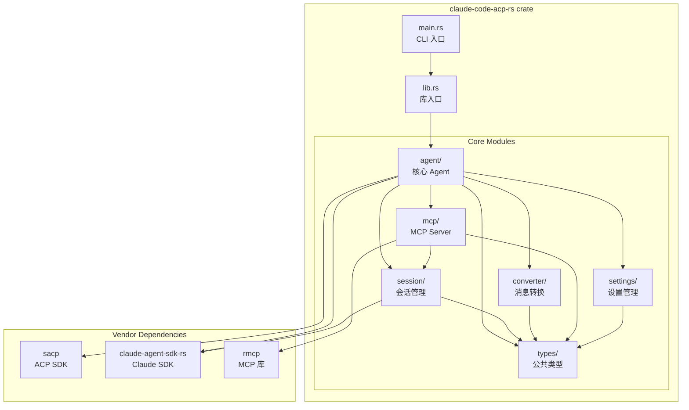

# Claude Code ACP Agent (Rust) 技术设计文档

## 1. 概述

### 1.1 项目目标

基于 Rust 语言实现 ACP (Agent Client Protocol) 协议的 Claude Code Agent，使任何 ACP 兼容的编辑器（如 Zed）都能使用 Claude Code 的能力。

### 1.2 参考项目

| 项目 | 位置 | 用途 |
|-----|------|-----|
| claude-code-acp (TypeScript) | `vendors/claude-code-acp` | 主要参考实现 |
| acp-rust-sdk (SACP) | `vendors/acp-rust-sdk` | ACP 协议 Rust SDK |
| claude-agent-sdk-rs | `vendors/claude-agent-sdk-rs` | Claude Code Rust SDK |
| agent-client-protocol | `vendors/agent-client-protocol` | ACP 协议 Schema 定义 |

### 1.3 设计原则

- Rust Edition 2024
- 使用 tokio 作为异步运行时
- 遵守 SOLID 原则
- 遵守 "Fail Fast" 原则
- 使用 dashmap 处理并发 Map 操作
- **单一 Crate 结构**: 项目作为单一 crate 发布到 crates.io，便于用户使用
- **依赖统一管理**: 根目录 Cargo.toml 使用 `[workspace.dependencies]` 统一管理依赖版本

### 1.4 业务要求

#### 1.4.1 环境变量配置

支持通过环境变量配置大模型，方便接入国内大模型服务：

| 环境变量 | 说明 | 必填 |
|---------|------|------|
| `ANTHROPIC_BASE_URL` | API 基础 URL | 否 |
| `ANTHROPIC_AUTH_TOKEN` | 认证 Token | 否 |
| `ANTHROPIC_MODEL` | 主模型名称 | 否 |
| `ANTHROPIC_SMALL_FAST_MODEL` | 快速小模型名称 | 否 |

#### 1.4.2 Token 用量统计

- 从 `ResultMessage.usage` 获取累计 Token 用量
- 从 `ResultMessage.total_cost_usd` 获取总费用
- 从 `AssistantMessage.message.usage` 获取单次调用用量
- 在会话结束时汇总统计信息

#### 1.4.3 MCP 库选择

- 使用 `rmcp` 作为 MCP 协议实现库（替代 sacp-rmcp）
- 参考 `vendors/acp-rust-sdk/src/sacp-rmcp` 的集成方式

#### 1.4.4 Meta 字段支持

ACP 协议的 `new_session` 和 `load_session` 请求中，`_meta` 字段用于传递额外配置信息：

**1. 系统提示词 (systemPrompt)**

允许客户端通过 meta 字段追加系统提示词：

```rust
/// Meta 中的系统提示词结构
/// meta._meta.systemPrompt.append = "自定义系统提示词"
#[derive(Debug, Clone, Serialize, Deserialize)]
pub struct SystemPromptMeta {
    /// 追加到系统提示词末尾的内容
    pub append: Option<String>,
    /// 替换整个系统提示词（优先级高于 append）
    pub replace: Option<String>,
}

impl SystemPromptMeta {
    /// 从 meta JSON 解析系统提示词配置
    pub fn from_meta(meta: &serde_json::Value) -> Option<Self> {
        meta.get("systemPrompt")
            .and_then(|v| serde_json::from_value(v.clone()).ok())
    }
}
```

**2. 恢复会话 (resume session_id)**

允许客户端恢复之前的会话：

```rust
/// Meta 中的 Claude Code 选项结构
/// meta._meta.claudeCode.options.resume = "session-uuid"
#[derive(Debug, Clone, Serialize, Deserialize)]
pub struct ClaudeCodeMeta {
    pub options: Option<ClaudeCodeOptions>,
}

#[derive(Debug, Clone, Serialize, Deserialize)]
pub struct ClaudeCodeOptions {
    /// 要恢复的会话 ID
    pub resume: Option<String>,
}

impl ClaudeCodeMeta {
    /// 从 meta JSON 解析 Claude Code 配置
    pub fn from_meta(meta: &serde_json::Value) -> Option<Self> {
        meta.get("claudeCode")
            .and_then(|v| serde_json::from_value(v.clone()).ok())
    }

    /// 获取要恢复的会话 ID
    pub fn get_resume_session_id(&self) -> Option<&str> {
        self.options.as_ref()?.resume.as_deref()
    }
}
```

**3. Meta 解析器**

统一的 meta 字段解析接口：

```rust
/// 新会话请求的 Meta 配置
pub struct NewSessionMeta {
    /// 系统提示词配置
    pub system_prompt: Option<SystemPromptMeta>,
    /// Claude Code 特定配置
    pub claude_code: Option<ClaudeCodeMeta>,
}

impl NewSessionMeta {
    /// 从 ACP 请求的 _meta 字段解析
    pub fn from_request_meta(meta: Option<&serde_json::Value>) -> Self {
        let meta = match meta {
            Some(m) => m,
            None => return Self::default(),
        };

        Self {
            system_prompt: SystemPromptMeta::from_meta(meta),
            claude_code: ClaudeCodeMeta::from_meta(meta),
        }
    }

    /// 获取要追加的系统提示词
    pub fn get_system_prompt_append(&self) -> Option<&str> {
        self.system_prompt.as_ref()?.append.as_deref()
    }

    /// 获取要恢复的会话 ID
    pub fn get_resume_session_id(&self) -> Option<&str> {
        self.claude_code.as_ref()?.get_resume_session_id()
    }
}

impl Default for NewSessionMeta {
    fn default() -> Self {
        Self {
            system_prompt: None,
            claude_code: None,
        }
    }
}
```

### 1.5 Claude SDK 集成概要

基于 `claude-agent-sdk-rs` 库，我们使用以下核心接口：

#### 1.5.1 核心 API 选择

| 场景 | 推荐 API | 说明 |
|------|---------|------|
| 会话管理 | `ClaudeClient` | 支持双向通信、动态控制、多会话 |
| 一次性查询 | `query()` / `query_stream()` | 简单场景使用 |
| 权限控制 | `can_use_tool` 回调 | 拦截工具调用进行权限判断 |
| 工具钩子 | `Hooks` 系统 | PreToolUse/PostToolUse 等钩子 |
| 内置工具 | `tool!` 宏 + `McpServerConfig::Sdk` | 创建内置 MCP 工具 |

#### 1.5.2 关键类型映射

| SDK 类型 | ACP 用途 |
|---------|---------|
| `ClaudeClient` | 每个 ACP Session 持有一个实例 |
| `ClaudeAgentOptions` | 会话创建时的配置 |
| `Message` | 转换为 ACP SessionNotification |
| `ResultMessage` | 获取 Token 用量和费用 |
| `PermissionMode` | 映射 ACP 的 session mode |
| `HookInput::PreToolUse` | 用于权限请求拦截 |

---

## 2. 高层架构设计

### 2.1 整体架构图


### 2.2 消息流程图


### 2.3 组件交互图


---

## 3. 核心模块设计

### 3.1 项目结构

项目作为单一 crate 发布到 crates.io，内部通过模块组织代码。

```
claude-code-acp-rs/
├── Cargo.toml                    # 主配置（含 workspace.dependencies）
├── Cargo.lock
├── src/
│   ├── main.rs                   # CLI 入口
│   ├── lib.rs                    # 库入口，导出公共 API
│   │
│   ├── agent/                    # Agent 核心模块
│   │   ├── mod.rs
│   │   ├── core.rs               # ClaudeAcpAgent 主结构
│   │   ├── handlers.rs           # ACP 请求处理器
│   │   └── runner.rs             # 服务启动器
│   │
│   ├── session/                  # 会话管理模块
│   │   ├── mod.rs
│   │   ├── manager.rs            # SessionManager
│   │   ├── state.rs              # Session 状态
│   │   ├── permission.rs         # 权限处理
│   │   └── usage.rs              # Token 用量统计
│   │
│   ├── converter/                # 消息转换模块
│   │   ├── mod.rs
│   │   ├── prompt.rs             # ACP → Claude SDK 转换
│   │   ├── notification.rs       # Claude SDK → ACP 转换
│   │   └── tool.rs               # 工具信息转换
│   │
│   ├── mcp/                      # 内置 MCP Server (使用 rmcp)
│   │   ├── mod.rs
│   │   ├── server.rs             # MCP Server 实现
│   │   └── tools/
│   │       ├── mod.rs
│   │       ├── read.rs           # Read 工具
│   │       ├── write.rs          # Write 工具
│   │       ├── edit.rs           # Edit 工具
│   │       └── bash.rs           # Bash 工具
│   │
│   ├── settings/                 # 设置管理模块
│   │   ├── mod.rs
│   │   └── manager.rs            # SettingsManager
│   │
│   ├── types/                    # 公共类型定义
│   │   ├── mod.rs
│   │   ├── config.rs             # AgentConfig, 环境变量配置
│   │   ├── meta.rs               # NewSessionMeta, SystemPromptMeta 等
│   │   ├── session.rs            # TokenUsage, SessionStats 等
│   │   ├── tool.rs               # ToolInfo, ToolKind 等
│   │   ├── notification.rs       # 通知相关类型
│   │   └── error.rs              # AgentError
│   │
│   └── util/                     # 工具函数
│       └── mod.rs
│
├── vendors/                      # 依赖的外部项目 (git submodule)
│   ├── acp-rust-sdk/
│   ├── claude-agent-sdk-rs/
│   ├── claude-code-acp/
│   └── agent-client-protocol/
│
└── specs/                        # 设计文档
    └── claude-code-acp/
```

### 3.2 模块依赖关系图



### 3.3 模块职责

| 模块 | 职责 | 主要依赖 |
|------|------|----------|
| `agent` | Agent 核心逻辑、ACP 请求处理、服务启动 | sacp, claude-agent-sdk-rs, session, converter, mcp |
| `session` | 会话创建、管理、状态维护、权限处理、Token 用量统计 | claude-agent-sdk-rs, types |
| `converter` | ACP ↔ Claude SDK 消息格式转换 | types |
| `mcp` | 内置 MCP Server 及工具实现 | rmcp, types, session |
| `settings` | 用户设置读取与管理 | types |
| `types` | 公共类型、错误定义、配置结构、Meta 解析、常量 | serde, thiserror |

### 3.4 公共 API 导出 (lib.rs)

```rust
//! Claude Code ACP Agent
//!
//! 基于 Rust 实现的 ACP 协议 Claude Code Agent，
//! 使任何 ACP 兼容的编辑器能够使用 Claude Code 的能力。
//!
//! ## 快速开始
//!
//! ```no_run
//! use claude_code_acp::run_acp;
//!
//! #[tokio::main]
//! async fn main() -> anyhow::Result<()> {
//!     run_acp().await
//! }
//! ```
//!
//! ## 环境变量配置
//!
//! - `ANTHROPIC_BASE_URL`: API 基础 URL
//! - `ANTHROPIC_AUTH_TOKEN`: 认证 Token
//! - `ANTHROPIC_MODEL`: 主模型名称
//! - `ANTHROPIC_SMALL_FAST_MODEL`: 快速小模型名称

pub mod agent;
pub mod converter;
pub mod mcp;
pub mod session;
pub mod settings;
pub mod types;

// Re-exports for convenience
pub use agent::run_acp;
pub use types::{AgentConfig, AgentError, NewSessionMeta};
```

---

## 4. 核心接口设计

### 4.1 Agent Trait 实现

Agent 需要实现 ACP 协议定义的所有必需方法：

```rust
/// ACP Agent 核心接口
/// 参考: sacp::schema 中的请求/响应类型
pub trait AcpAgentHandler {
    /// 初始化 Agent，返回能力信息
    async fn initialize(&self, request: InitializeRequest) -> Result<InitializeResponse>;

    /// 认证（可选实现）
    async fn authenticate(&self, request: AuthenticateRequest) -> Result<AuthenticateResponse>;

    /// 创建新会话
    async fn new_session(&self, request: NewSessionRequest) -> Result<NewSessionResponse>;

    /// 执行 prompt
    async fn prompt(&self, request: PromptRequest) -> Result<PromptResponse>;

    /// 取消当前操作
    async fn cancel(&self, notification: CancelNotification) -> Result<()>;

    /// 设置会话模式
    async fn set_session_mode(&self, request: SetSessionModeRequest) -> Result<SetSessionModeResponse>;

    // Unstable APIs
    async fn fork_session(&self, request: ForkSessionRequest) -> Result<ForkSessionResponse>;
    async fn resume_session(&self, request: ResumeSessionRequest) -> Result<ResumeSessionResponse>;
}
```

### 4.2 环境变量配置接口

```rust
/// Agent 配置，从环境变量读取
#[derive(Debug, Clone, Default)]
pub struct AgentConfig {
    /// Anthropic API 基础 URL
    pub base_url: Option<String>,
    /// 认证 Token
    pub auth_token: Option<String>,
    /// 主模型名称
    pub model: Option<String>,
    /// 快速小模型名称（用于 fallback）
    pub small_fast_model: Option<String>,
}

impl AgentConfig {
    /// 从环境变量加载配置
    pub fn from_env() -> Self {
        Self {
            base_url: std::env::var("ANTHROPIC_BASE_URL").ok(),
            auth_token: std::env::var("ANTHROPIC_AUTH_TOKEN").ok(),
            model: std::env::var("ANTHROPIC_MODEL").ok(),
            small_fast_model: std::env::var("ANTHROPIC_SMALL_FAST_MODEL").ok(),
        }
    }

    /// 应用配置到 ClaudeAgentOptions
    /// 注意：base_url 和 auth_token 需要通过环境变量传递给 Claude Code CLI
    pub fn apply_to_options(&self, builder: ClaudeAgentOptionsBuilder) -> ClaudeAgentOptionsBuilder {
        let mut b = builder;
        if let Some(ref model) = self.model {
            b = b.model(model.clone());
        }
        if let Some(ref fallback) = self.small_fast_model {
            b = b.fallback_model(fallback.clone());
        }
        // base_url 和 auth_token 通过 env 选项传递
        if self.base_url.is_some() || self.auth_token.is_some() {
            let mut env = HashMap::new();
            if let Some(ref url) = self.base_url {
                env.insert("ANTHROPIC_BASE_URL".to_string(), url.clone());
            }
            if let Some(ref token) = self.auth_token {
                env.insert("ANTHROPIC_AUTH_TOKEN".to_string(), token.clone());
            }
            b = b.env(env);
        }
        b
    }
}
```

### 4.3 Token 用量统计接口

```rust
use claude_agent_sdk_rs::{Message, ResultMessage, AssistantMessage};

/// Token 使用统计（基于 SDK 的 usage 字段）
#[derive(Debug, Clone, Default, Serialize, Deserialize)]
pub struct TokenUsage {
    /// 输入 Token 数
    pub input_tokens: u64,
    /// 输出 Token 数
    pub output_tokens: u64,
    /// 缓存读取 Token 数
    pub cache_read_input_tokens: Option<u64>,
    /// 缓存创建 Token 数
    pub cache_creation_input_tokens: Option<u64>,
}

impl TokenUsage {
    /// 从 SDK 的 usage JSON 解析
    pub fn from_sdk_usage(usage: &serde_json::Value) -> Self {
        Self {
            input_tokens: usage["input_tokens"].as_u64().unwrap_or(0),
            output_tokens: usage["output_tokens"].as_u64().unwrap_or(0),
            cache_read_input_tokens: usage["cache_read_input_tokens"].as_u64(),
            cache_creation_input_tokens: usage["cache_creation_input_tokens"].as_u64(),
        }
    }

    /// 累加使用量
    pub fn add(&mut self, other: &TokenUsage) {
        self.input_tokens += other.input_tokens;
        self.output_tokens += other.output_tokens;
        if let Some(v) = other.cache_read_input_tokens {
            *self.cache_read_input_tokens.get_or_insert(0) += v;
        }
        if let Some(v) = other.cache_creation_input_tokens {
            *self.cache_creation_input_tokens.get_or_insert(0) += v;
        }
    }

    /// 总 Token 数
    pub fn total(&self) -> u64 {
        self.input_tokens + self.output_tokens
    }
}

/// 会话用量追踪器
pub struct UsageTracker {
    /// 累计用量
    total_usage: RwLock<TokenUsage>,
    /// 总费用 (USD)
    total_cost_usd: AtomicU64,  // 存储 f64 的 bits
}

impl UsageTracker {
    pub fn new() -> Self {
        Self {
            total_usage: RwLock::new(TokenUsage::default()),
            total_cost_usd: AtomicU64::new(0),
        }
    }

    /// 从 SDK ResultMessage 更新用量（在 prompt 结束时调用）
    pub fn update_from_result(&self, result: &ResultMessage) {
        if let Some(ref usage) = result.usage {
            let mut total = self.total_usage.write().unwrap();
            *total = TokenUsage::from_sdk_usage(usage);
        }
        if let Some(cost) = result.total_cost_usd {
            self.total_cost_usd.store(cost.to_bits(), Ordering::SeqCst);
        }
    }

    /// 获取累计用量
    pub fn get_usage(&self) -> TokenUsage {
        self.total_usage.read().unwrap().clone()
    }

    /// 获取总费用
    pub fn get_cost_usd(&self) -> f64 {
        f64::from_bits(self.total_cost_usd.load(Ordering::SeqCst))
    }
}
```

### 4.4 Session 管理接口

使用 `ClaudeClient` 作为核心通信接口：

```rust
use claude_agent_sdk_rs::{
    ClaudeClient, ClaudeAgentOptions, Message, UserContentBlock,
    PermissionMode as SdkPermissionMode,
};
use futures::StreamExt;
use tokio::sync::mpsc;

/// 会话状态 - 每个 ACP Session 持有一个 ClaudeClient 实例
pub struct Session {
    /// Claude SDK 的 Client 实例（支持双向流式通信）
    pub client: ClaudeClient,
    /// 是否已取消
    pub cancelled: AtomicBool,
    /// 当前权限模式
    pub permission_mode: RwLock<SdkPermissionMode>,
    /// 设置管理器
    pub settings_manager: SettingsManager,
    /// Token 用量追踪器
    pub usage_tracker: UsageTracker,
    /// 会话 ID
    pub session_id: String,
    /// 工作目录
    pub cwd: PathBuf,
    /// 通知转换器
    pub converter: NotificationConverter,
}

impl Session {
    /// 创建新会话
    pub async fn new(
        session_id: String,
        cwd: PathBuf,
        config: &AgentConfig,
        permission_handler: Arc<PermissionHandler>,
    ) -> Result<Self> {
        // 构建 ClaudeAgentOptions
        let mut builder = ClaudeAgentOptions::builder()
            .cwd(cwd.clone())
            .permission_mode(SdkPermissionMode::Default)
            .include_partial_messages(true);

        // 应用环境变量配置 (ANTHROPIC_BASE_URL, ANTHROPIC_AUTH_TOKEN 等)
        builder = config.apply_to_options(builder);

        // 设置权限回调
        builder = builder.can_use_tool(permission_handler.create_can_use_tool_callback());

        let options = builder.build();

        // 使用 try_new 进行早期验证
        let mut client = ClaudeClient::try_new(options)?;
        client.connect().await?;

        Ok(Self {
            client,
            cancelled: AtomicBool::new(false),
            permission_mode: RwLock::new(SdkPermissionMode::Default),
            settings_manager: SettingsManager::new(&cwd).await?,
            usage_tracker: UsageTracker::new(),
            session_id,
            cwd,
            converter: NotificationConverter::new(),
        })
    }

    /// 发送 prompt 并返回消息流（处理直到 ResultMessage）
    pub async fn prompt(
        &mut self,
        content: Vec<UserContentBlock>,
    ) -> Result<impl Stream<Item = Result<Message>>> {
        // 重置取消标志
        self.cancelled.store(false, Ordering::SeqCst);

        // 发送内容到 Claude
        self.client.query_with_content_and_session(
            content,
            &self.session_id,
        ).await?;

        // 返回响应流（直到 ResultMessage）
        Ok(self.client.receive_response())
    }

    /// 发送文本 prompt
    pub async fn prompt_text(&mut self, text: &str) -> Result<impl Stream<Item = Result<Message>>> {
        self.prompt(vec![UserContentBlock::text(text)]).await
    }

    /// 中断当前执行
    pub async fn interrupt(&self) -> Result<()> {
        self.cancelled.store(true, Ordering::SeqCst);
        self.client.interrupt().await
    }

    /// 设置权限模式
    pub async fn set_permission_mode(&self, mode: SdkPermissionMode) -> Result<()> {
        self.client.set_permission_mode(mode).await?;
        *self.permission_mode.write().unwrap() = mode;
        Ok(())
    }

    /// 设置模型
    pub async fn set_model(&self, model: Option<&str>) -> Result<()> {
        self.client.set_model(model).await
    }

    /// 获取服务器信息
    pub async fn get_server_info(&self) -> Option<serde_json::Value> {
        self.client.get_server_info().await
    }

    /// 处理消息流并更新用量统计
    pub async fn process_response_stream(
        &self,
        notifier: &impl AcpNotifier,
    ) -> Result<()> {
        let mut stream = self.client.receive_response();

        while let Some(result) = stream.next().await {
            let message = result?;

            // 转换为 ACP 通知并发送
            let notifications = self.converter.convert_message(&message, &self.session_id);
            for notification in notifications {
                notifier.send_notification(notification).await;
            }

            // 如果是 ResultMessage，更新用量统计
            if let Message::Result(result) = &message {
                self.usage_tracker.update_from_result(result);
            }
        }

        Ok(())
    }

    /// 断开连接
    pub async fn disconnect(&mut self) -> Result<()> {
        self.client.disconnect().await
    }
}

/// 会话管理器
pub struct SessionManager {
    /// 使用 DashMap 实现并发安全的会话存储
    sessions: DashMap<String, Arc<tokio::sync::RwLock<Session>>>,
    /// 客户端能力
    client_capabilities: Option<ClientCapabilities>,
    /// Agent 配置
    config: AgentConfig,
    /// 权限处理器
    permission_handler: Arc<PermissionHandler>,
}

impl SessionManager {
    pub fn new(config: AgentConfig, permission_handler: Arc<PermissionHandler>) -> Self {
        Self {
            sessions: DashMap::new(),
            client_capabilities: None,
            config,
            permission_handler,
        }
    }

    pub fn set_client_capabilities(&mut self, caps: ClientCapabilities) {
        self.client_capabilities = Some(caps);
    }

    /// 创建新会话
    pub async fn create_session(&self, session_id: String, cwd: PathBuf) -> Result<Arc<tokio::sync::RwLock<Session>>> {
        let session = Session::new(
            session_id.clone(),
            cwd,
            &self.config,
            Arc::clone(&self.permission_handler),
        ).await?;

        let session = Arc::new(tokio::sync::RwLock::new(session));
        self.sessions.insert(session_id, Arc::clone(&session));
        Ok(session)
    }

    /// 获取会话
    pub fn get_session(&self, session_id: &str) -> Option<Arc<tokio::sync::RwLock<Session>>> {
        self.sessions.get(session_id).map(|r| Arc::clone(r.value()))
    }

    /// 移除会话
    pub async fn remove_session(&self, session_id: &str) -> Option<Arc<tokio::sync::RwLock<Session>>> {
        if let Some((_, session)) = self.sessions.remove(session_id) {
            // 断开连接
            let mut guard = session.write().await;
            let _ = guard.disconnect().await;
            drop(guard);
            Some(session)
        } else {
            None
        }
    }

    /// 获取会话统计信息
    pub fn get_session_stats(&self) -> SessionStats {
        SessionStats {
            active_sessions: self.sessions.len(),
        }
    }
}

pub struct SessionStats {
    pub active_sessions: usize,
}
```

### 4.5 权限处理接口

使用 `claude-agent-sdk-rs` 提供的权限类型，确保与 SDK 一致：

```rust
use claude_agent_sdk_rs::types::{
    PermissionMode, PermissionResult, PermissionResultAllow, PermissionResultDeny,
    PermissionUpdate, PermissionUpdateType, PermissionRuleValue, PermissionBehavior,
    PermissionUpdateDestination, ToolPermissionContext, CanUseToolCallback,
};

// SDK 已定义的权限模式（直接使用）
// pub enum PermissionMode {
//     Default,           // 默认模式，每个操作都需要确认
//     AcceptEdits,       // 自动接受文件编辑操作
//     Plan,              // 计划模式，不执行实际操作
//     BypassPermissions, // 绕过所有权限检查
// }

/// 权限处理器 - 桥接 ACP 权限请求和 SDK 权限回调
pub struct PermissionHandler {
    /// 待处理的权限请求
    pending_requests: DashMap<String, PendingPermissionRequest>,
    /// ACP 客户端通知发送器
    notifier: Arc<dyn AcpNotifier>,
}

/// 待处理的权限请求
pub struct PendingPermissionRequest {
    pub tool_name: String,
    pub tool_input: serde_json::Value,
    pub tool_use_id: String,
    pub suggestions: Vec<PermissionUpdate>,
    /// 完成通道
    pub response_tx: oneshot::Sender<PermissionResult>,
}

impl PermissionHandler {
    /// 创建权限回调，用于传递给 ClaudeAgentOptions
    pub fn create_can_use_tool_callback(&self) -> CanUseToolCallback {
        let pending = self.pending_requests.clone();
        let notifier = self.notifier.clone();

        Arc::new(move |tool_name, tool_input, context: ToolPermissionContext| {
            let pending = pending.clone();
            let notifier = notifier.clone();

            Box::pin(async move {
                // 生成唯一请求 ID
                let request_id = uuid::Uuid::new_v4().to_string();

                // 创建完成通道
                let (tx, rx) = oneshot::channel();

                // 存储待处理请求
                pending.insert(request_id.clone(), PendingPermissionRequest {
                    tool_name: tool_name.clone(),
                    tool_input: tool_input.clone(),
                    tool_use_id: request_id.clone(),
                    suggestions: context.suggestions,
                    response_tx: tx,
                });

                // 发送 ACP permission_request 通知
                notifier.send_permission_request(&request_id, &tool_name, &tool_input).await;

                // 等待 ACP 客户端响应
                match rx.await {
                    Ok(result) => result,
                    Err(_) => PermissionResult::Deny(PermissionResultDeny {
                        message: "Permission request cancelled".to_string(),
                        interrupt: true,
                    }),
                }
            })
        })
    }

    /// 处理来自 ACP 客户端的权限响应
    pub fn handle_permission_response(&self, request_id: &str, allowed: bool, message: Option<String>) {
        if let Some((_, request)) = self.pending_requests.remove(request_id) {
            let result = if allowed {
                PermissionResult::Allow(PermissionResultAllow {
                    updated_input: None,
                    updated_permissions: None,
                })
            } else {
                PermissionResult::Deny(PermissionResultDeny {
                    message: message.unwrap_or_else(|| "Denied by user".to_string()),
                    interrupt: false,
                })
            };
            let _ = request.response_tx.send(result);
        }
    }
}

/// ACP 权限模式到 SDK 模式的转换
pub fn acp_mode_to_sdk_mode(acp_mode: &str) -> PermissionMode {
    match acp_mode {
        "default" => PermissionMode::Default,
        "acceptEdits" => PermissionMode::AcceptEdits,
        "plan" => PermissionMode::Plan,
        "bypassPermissions" => PermissionMode::BypassPermissions,
        _ => PermissionMode::Default,
    }
}

/// SDK 权限模式到 ACP 模式字符串
pub fn sdk_mode_to_acp_mode(mode: PermissionMode) -> &'static str {
    match mode {
        PermissionMode::Default => "default",
        PermissionMode::AcceptEdits => "acceptEdits",
        PermissionMode::Plan => "plan",
        PermissionMode::BypassPermissions => "bypassPermissions",
    }
}
```

### 4.6 通知转换接口

使用 SDK 的实际消息类型进行转换：

```rust
use claude_agent_sdk_rs::types::{
    Message, AssistantMessage, SystemMessage, ResultMessage, StreamEvent,
    ContentBlock, TextBlock, ThinkingBlock, ToolUseBlock, ToolResultBlock,
};
use sacp::schema::{SessionNotification, SessionUpdateNotification};

/// 通知转换器 - 将 SDK 消息转换为 ACP SessionNotification
pub struct NotificationConverter {
    /// 工具使用缓存，用于关联 tool_use 和 tool_result
    tool_use_cache: DashMap<String, ToolUseEntry>,
}

impl NotificationConverter {
    pub fn new() -> Self {
        Self {
            tool_use_cache: DashMap::new(),
        }
    }

    /// 转换 SDK Message 为 ACP 通知列表
    pub fn convert_message(&self, message: &Message, session_id: &str) -> Vec<SessionNotification> {
        match message {
            Message::Assistant(assistant) => {
                self.convert_assistant_message(assistant, session_id)
            }
            Message::StreamEvent(event) => {
                self.convert_stream_event(event, session_id)
            }
            Message::Result(result) => {
                // ResultMessage 不直接转换为通知，而是用于更新用量统计
                // 但可以生成 session_end 通知
                vec![]
            }
            Message::System(system) => {
                // System 消息一般用于内部状态，不转换为 ACP 通知
                vec![]
            }
            _ => vec![],
        }
    }

    /// 转换 AssistantMessage
    fn convert_assistant_message(
        &self,
        assistant: &AssistantMessage,
        session_id: &str,
    ) -> Vec<SessionNotification> {
        let mut notifications = vec![];

        for block in &assistant.message.content {
            match block {
                ContentBlock::Text(text) => {
                    notifications.push(self.make_agent_message_notification(
                        session_id,
                        &text.text,
                    ));
                }
                ContentBlock::Thinking(thinking) => {
                    notifications.push(self.make_agent_thought_notification(
                        session_id,
                        &thinking.thinking,
                    ));
                }
                ContentBlock::ToolUse(tool_use) => {
                    // 缓存 tool_use 以便后续关联 tool_result
                    self.tool_use_cache.insert(tool_use.id.clone(), ToolUseEntry {
                        tool_type: ToolUseType::ToolUse,
                        id: tool_use.id.clone(),
                        name: tool_use.name.clone(),
                        input: tool_use.input.clone(),
                    });

                    notifications.push(self.make_tool_call_notification(
                        session_id,
                        tool_use,
                    ));
                }
                ContentBlock::ToolResult(tool_result) => {
                    // 查找对应的 tool_use
                    if let Some(entry) = self.tool_use_cache.get(&tool_result.tool_use_id) {
                        notifications.push(self.make_tool_result_notification(
                            session_id,
                            &entry,
                            tool_result,
                        ));
                    }
                }
                ContentBlock::Image(_) => {
                    // 图片块暂不转换为 ACP 通知
                }
            }
        }

        notifications
    }

    /// 转换 StreamEvent (用于增量流式更新)
    fn convert_stream_event(
        &self,
        event: &StreamEvent,
        session_id: &str,
    ) -> Vec<SessionNotification> {
        // StreamEvent.event 是 serde_json::Value，需要解析具体类型
        let event_type = event.event.get("type").and_then(|v| v.as_str());

        match event_type {
            Some("content_block_delta") => {
                // 处理增量文本
                if let Some(delta) = event.event.get("delta") {
                    if let Some(text) = delta.get("text").and_then(|v| v.as_str()) {
                        return vec![self.make_agent_message_chunk_notification(
                            session_id,
                            text,
                        )];
                    }
                    if let Some(thinking) = delta.get("thinking").and_then(|v| v.as_str()) {
                        return vec![self.make_agent_thought_chunk_notification(
                            session_id,
                            thinking,
                        )];
                    }
                }
                vec![]
            }
            Some("content_block_start") => {
                // 可以用于检测 tool_use 开始
                vec![]
            }
            _ => vec![],
        }
    }

    // Helper 方法创建各类通知...
    fn make_agent_message_notification(&self, session_id: &str, text: &str) -> SessionNotification {
        SessionNotification::Update(SessionUpdateNotification {
            session_id: session_id.to_string(),
            update: SessionUpdate::AgentMessage {
                content: text.to_string(),
            },
        })
    }

    fn make_agent_message_chunk_notification(&self, session_id: &str, chunk: &str) -> SessionNotification {
        SessionNotification::Update(SessionUpdateNotification {
            session_id: session_id.to_string(),
            update: SessionUpdate::AgentMessageChunk {
                content: chunk.to_string(),
            },
        })
    }

    fn make_agent_thought_notification(&self, session_id: &str, thought: &str) -> SessionNotification {
        SessionNotification::Update(SessionUpdateNotification {
            session_id: session_id.to_string(),
            update: SessionUpdate::AgentThought {
                content: thought.to_string(),
            },
        })
    }

    fn make_agent_thought_chunk_notification(&self, session_id: &str, chunk: &str) -> SessionNotification {
        SessionNotification::Update(SessionUpdateNotification {
            session_id: session_id.to_string(),
            update: SessionUpdate::AgentThoughtChunk {
                content: chunk.to_string(),
            },
        })
    }

    fn make_tool_call_notification(
        &self,
        session_id: &str,
        tool_use: &ToolUseBlock,
    ) -> SessionNotification {
        let tool_info = self.extract_tool_info(&tool_use.name, &tool_use.input);
        SessionNotification::Update(SessionUpdateNotification {
            session_id: session_id.to_string(),
            update: SessionUpdate::ToolCall {
                tool_call_id: tool_use.id.clone(),
                tool_name: tool_use.name.clone(),
                tool_input: tool_use.input.clone(),
                tool_info,
            },
        })
    }

    fn make_tool_result_notification(
        &self,
        session_id: &str,
        entry: &ToolUseEntry,
        result: &ToolResultBlock,
    ) -> SessionNotification {
        let output = match &result.content {
            Some(ToolResultContent::Text(text)) => text.clone(),
            Some(ToolResultContent::Blocks(blocks)) => {
                serde_json::to_string(blocks).unwrap_or_default()
            }
            None => String::new(),
        };

        SessionNotification::Update(SessionUpdateNotification {
            session_id: session_id.to_string(),
            update: SessionUpdate::ToolCallUpdate {
                tool_call_id: entry.id.clone(),
                status: if result.is_error.unwrap_or(false) {
                    ToolCallStatus::Error
                } else {
                    ToolCallStatus::Completed
                },
                output: Some(output),
            },
        })
    }

    /// 从工具名称和输入提取工具信息（用于 UI 展示）
    fn extract_tool_info(&self, name: &str, input: &serde_json::Value) -> Option<ToolInfo> {
        let (kind, title, locations) = match name {
            "Read" => {
                let path = input.get("file_path").and_then(|v| v.as_str()).unwrap_or("file");
                (ToolKind::Read, format!("Read {}", path), Some(vec![path.to_string()]))
            }
            "Edit" => {
                let path = input.get("file_path").and_then(|v| v.as_str()).unwrap_or("file");
                (ToolKind::Edit, format!("Edit {}", path), Some(vec![path.to_string()]))
            }
            "Write" => {
                let path = input.get("file_path").and_then(|v| v.as_str()).unwrap_or("file");
                (ToolKind::Edit, format!("Write {}", path), Some(vec![path.to_string()]))
            }
            "Bash" => {
                let cmd = input.get("command").and_then(|v| v.as_str()).unwrap_or("");
                let desc = input.get("description").and_then(|v| v.as_str());
                let title = desc.map(|d| d.to_string())
                    .unwrap_or_else(|| format!("Run: {}", cmd.chars().take(50).collect::<String>()));
                (ToolKind::Execute, title, None)
            }
            "Grep" | "Glob" => {
                let pattern = input.get("pattern").and_then(|v| v.as_str()).unwrap_or("");
                (ToolKind::Search, format!("Search: {}", pattern), None)
            }
            "WebFetch" => {
                let url = input.get("url").and_then(|v| v.as_str()).unwrap_or("");
                (ToolKind::Fetch, format!("Fetch {}", url), None)
            }
            _ => (ToolKind::Other, name.to_string(), None),
        };

        Some(ToolInfo {
            title,
            kind,
            content: vec![],
            locations: locations.map(|l| l.into_iter().map(|p| ToolCallLocation { path: p }).collect()),
        })
    }
}

/// 工具使用缓存条目
pub struct ToolUseEntry {
    pub tool_type: ToolUseType,
    pub id: String,
    pub name: String,
    pub input: serde_json::Value,
}

pub enum ToolUseType {
    ToolUse,
    ServerToolUse,
    McpToolUse,
}
```

### 4.7 MCP Server 接口

```rust
/// 内置 MCP Server 工具
pub trait McpTool: Send + Sync {
    /// 工具名称
    fn name(&self) -> &'static str;

    /// 工具描述
    fn description(&self) -> &'static str;

    /// 输入 Schema
    fn input_schema(&self) -> serde_json::Value;

    /// 执行工具
    async fn execute(&self, input: serde_json::Value, context: ToolContext) -> Result<ToolResult>;
}

/// 工具执行上下文
pub struct ToolContext {
    pub session_id: String,
    pub agent: Arc<ClaudeAcpAgent>,
    pub client_capabilities: Option<ClientCapabilities>,
}
```

---

## 5. 核心数据结构

### 5.1 ToolUse 缓存

工具使用缓存类型已在 Section 4.6 中定义，这里说明其并发存储方式：

```rust
/// ToolUseEntry 和 ToolUseType 定义见 Section 4.6

/// 使用 DashMap 存储，支持并发访问
/// 注意：使用 entry API 避免并发死锁
pub type ToolUseCache = DashMap<String, ToolUseEntry>;

impl ToolUseCache {
    /// 插入新的工具使用记录（推荐使用 entry API）
    pub fn insert_tool_use(&self, entry: ToolUseEntry) {
        self.entry(entry.id.clone()).or_insert(entry);
    }

    /// 获取并移除工具使用记录
    pub fn take_tool_use(&self, id: &str) -> Option<ToolUseEntry> {
        self.remove(id).map(|(_, v)| v)
    }
}
```

### 5.2 后台终端状态

```rust
/// 后台终端状态
pub enum BackgroundTerminal {
    Started {
        handle: TerminalHandle,
        last_output: Option<TerminalOutputResponse>,
    },
    Finished {
        status: TerminalFinishStatus,
        pending_output: TerminalOutputResponse,
    },
}

pub enum TerminalFinishStatus {
    Aborted,
    Exited,
    Killed,
    TimedOut,
}
```

### 5.3 工具信息

```rust
/// 工具调用信息
pub struct ToolInfo {
    pub title: String,
    pub kind: ToolKind,
    pub content: Vec<ToolCallContent>,
    pub locations: Option<Vec<ToolCallLocation>>,
}

/// 工具类型
pub enum ToolKind {
    Read,
    Edit,
    Execute,
    Search,
    Fetch,
    Think,
    SwitchMode,
    Other,
}
```

---

## 6. 消息转换流程

### 6.1 Prompt 转换 (ACP → Claude SDK)


### 6.2 通知转换 (Claude SDK → ACP)


---

## 7. 错误处理设计

### 7.1 错误类型

```rust
/// Agent 错误类型
#[derive(Debug, thiserror::Error)]
pub enum AgentError {
    #[error("Session not found: {0}")]
    SessionNotFound(String),

    #[error("Authentication required")]
    AuthRequired,

    #[error("Invalid mode: {0}")]
    InvalidMode(String),

    #[error("Tool execution failed: {0}")]
    ToolExecutionFailed(String),

    #[error("Claude SDK error: {0}")]
    ClaudeSdkError(#[from] claude_agent_sdk_rs::ClaudeError),

    #[error("IO error: {0}")]
    IoError(#[from] std::io::Error),

    #[error("JSON error: {0}")]
    JsonError(#[from] serde_json::Error),

    #[error("Internal error: {0}")]
    Internal(String),
}

/// 转换为 ACP RequestError
impl From<AgentError> for sacp::RequestError {
    fn from(err: AgentError) -> Self {
        match err {
            AgentError::AuthRequired => RequestError::auth_required(),
            AgentError::SessionNotFound(id) => RequestError::invalid_params(&format!("Session not found: {}", id)),
            _ => RequestError::internal_error(None, &err.to_string()),
        }
    }
}
```

---

## 8. 并发设计

### 8.1 会话并发管理


### 8.2 关键并发点

1. **SessionManager**: 使用 `DashMap<String, Arc<Session>>` 管理会话
2. **ToolUseCache**: 使用 `DashMap<String, ToolUseEntry>` 缓存工具调用
3. **Session.cancelled**: 使用 `AtomicBool` 标记取消状态
4. **Session.permission_mode**: 使用 `RwLock<PermissionMode>` 保护模式切换

---

## 9. 依赖设计

### 9.1 Cargo.toml (单一 Crate)

```toml
[package]
name = "claude-code-acp"
version = "0.1.0"
edition = "2024"
authors = ["guochao.song <soddygo@qq.com>"]
description = "Use Claude Code from any ACP client - Rust implementation of ACP protocol agent"
repository = "https://github.com/soddygo/claude-code-acp-rs"
license = "MIT"
keywords = ["claude", "acp", "agent", "ai", "llm"]
categories = ["development-tools", "command-line-utilities"]
readme = "README.md"

[[bin]]
name = "claude-code-acp"
path = "src/main.rs"

[lib]
name = "claude_code_acp"
path = "src/lib.rs"

[dependencies]
# ACP Protocol
sacp = { path = "vendors/acp-rust-sdk/src/sacp" }
sacp-tokio = { path = "vendors/acp-rust-sdk/src/sacp-tokio" }

# Claude Code SDK
claude-agent-sdk-rs = { path = "vendors/claude-agent-sdk-rs" }

# MCP Protocol
rmcp = "0.1"  # 使用最新版本的 rmcp

# Async Runtime
tokio = { version = "1", features = ["full"] }
futures = "0.3"
async-stream = "0.3"

# Concurrency
dashmap = "6"

# Serialization
serde = { version = "1", features = ["derive"] }
serde_json = "1"

# Error Handling
thiserror = "2"
anyhow = "1"

# Utilities
uuid = { version = "1", features = ["v4"] }
tracing = "0.1"
tracing-subscriber = { version = "0.3", features = ["env-filter"] }

[dev-dependencies]
tokio-test = "0.4"
tempfile = "3"
```

### 9.2 Feature Flags (可选)

```toml
[features]
default = ["mcp"]
# 启用内置 MCP Server
mcp = ["rmcp"]
# 启用完整日志
full-logging = ["tracing-subscriber/json"]
```

### 9.3 发布到 crates.io

发布前检查清单：

1. **更新版本号**: `Cargo.toml` 中的 `version`
2. **更新 CHANGELOG**: 记录变更
3. **确保文档完整**: `README.md`, rustdoc
4. **运行测试**: `cargo test`
5. **检查 lint**: `cargo clippy`
6. **dry-run 发布**: `cargo publish --dry-run`
7. **正式发布**: `cargo publish`

注意：vendors 目录下的依赖在发布时需要使用 crates.io 版本或 git 依赖：

```toml
# 发布版本的依赖配置
[dependencies]
sacp = "0.1"  # 发布到 crates.io 后使用版本号
claude-agent-sdk-rs = { git = "https://github.com/soddygo/claude-agent-sdk-rs.git", tag = "v0.1.0" }
```

---

## 10. 启动流程

### 10.1 CLI 入口 (src/main.rs)

```rust
//! Claude Code ACP Agent CLI 入口
//!
//! 这是一个简单的入口文件，委托给 acp-agent crate 处理

use acp_agent::run_acp;

#[tokio::main]
async fn main() -> anyhow::Result<()> {
    // 初始化日志
    tracing_subscriber::fmt()
        .with_env_filter(
            tracing_subscriber::EnvFilter::from_default_env()
                .add_directive(tracing::Level::INFO.into()),
        )
        .init();

    // 启动 ACP Agent
    run_acp().await
}
```

### 10.2 Agent 运行器 (crates/acp-agent/src/runner.rs)

```rust
use acp_types::AgentConfig;
use sacp::{ByteStreams, JrHandlerChain};
use std::io::{stdin, stdout};

use crate::agent::ClaudeAcpAgent;

/// 启动 ACP Agent，通过 stdin/stdout 提供服务
pub async fn run_acp() -> anyhow::Result<()> {
    // 从环境变量加载配置
    let config = AgentConfig::from_env();

    // 创建 Agent
    let agent = ClaudeAcpAgent::new(config);

    JrHandlerChain::new()
        .name("claude-code-acp")
        .on_receive_request(|req: InitializeRequest, cx| async move {
            let response = agent.initialize(req).await?;
            cx.respond(response)
        })
        .on_receive_request(|req: NewSessionRequest, cx| async move {
            let response = agent.new_session(req).await?;
            cx.respond(response)
        })
        .on_receive_request(|req: PromptRequest, cx| async move {
            let response = agent.prompt(req).await?;
            cx.respond(response)
        })
        // ... 其他处理器
        .serve(ByteStreams::new(stdout(), stdin()))
        .await?;

    Ok(())
}
```

### 10.3 服务启动流程


---

## 11. 测试策略

### 11.1 单元测试

- 消息转换测试 (Prompt 转换、通知转换)
- 权限检查测试
- 工具信息提取测试

### 11.2 集成测试

- ACP 协议交互测试
- Claude SDK 集成测试
- MCP Server 工具测试

### 11.3 E2E 测试

- 完整会话流程测试
- 多会话并发测试
- 错误恢复测试

---

## 12. 后续扩展

### 12.1 Phase 1 - MVP (基础搭建)

- [ ] 创建项目结构和所有模块骨架
- [ ] 实现 `types/` 公共类型（含 AgentConfig、TokenUsage、NewSessionMeta）
- [ ] 实现环境变量配置加载
- [ ] 实现 Meta 字段解析（systemPrompt、resume session_id）
- [ ] 实现基础 ACP 协议支持 (initialize, new_session, prompt, cancel)
- [ ] Claude SDK 集成
- [ ] 基本通知转换 (`converter/`)

### 12.2 Phase 2 - 功能完善

- [ ] `mcp/` MCP Server 工具实现（使用 rmcp）
- [ ] `session/` 权限系统完善
- [ ] `session/` Token 用量统计
- [ ] 会话 Fork/Resume 支持（使用 meta.claudeCode.options.resume）
- [ ] `settings/` 设置管理实现

### 12.3 Phase 3 - 优化与发布

- [ ] 性能优化
- [ ] 更完善的错误处理
- [ ] 日志和监控
- [ ] 单元测试和集成测试
- [ ] rustdoc 文档完善
- [ ] 发布到 crates.io

---

## 13. 附录

### 13.1 ACP 协议方法映射

| ACP Method | Handler | Claude SDK API |
|------------|---------|----------------|
| `initialize` | InitializeHandler | - |
| `session/new` | NewSessionHandler | `query()` |
| `session/prompt` | PromptHandler | `Query.next()` |
| `session/cancel` | CancelHandler | `Query.interrupt()` |
| `session/set_mode` | SetModeHandler | `Query.setPermissionMode()` |

### 13.2 工具名称映射

| ACP Tool Name | Claude Tool Name |
|---------------|------------------|
| `mcp__acp__Read` | `Read` |
| `mcp__acp__Write` | `Write` |
| `mcp__acp__Edit` | `Edit` |
| `mcp__acp__Bash` | `Bash` |
| `mcp__acp__KillShell` | `KillShell` |
| `mcp__acp__BashOutput` | `BashOutput` |
